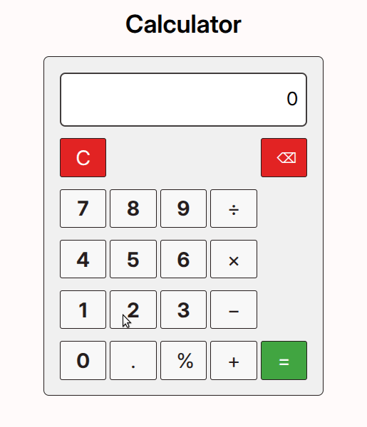

# Calculator

This project (calculator) is the fifth and last project of the [Foundations course](https://www.theodinproject.com/paths/foundations/courses/foundations).

This project implements a simple calculator that can perform the basic mathematical operations such as:
- &plus; addition
- &minus; subtraction
- &times; multiplication
- &divide; division
- % percentage

The calculator, for the sake of simplicity and as mentioned in the project specification, does not evaluate more than a single pair of numbers at a time.

The calculator supports a "clear" button to clear both the screen and its internal memory.

It also supports a "backspace" button to delete one digit at a time from the right.

**Example of calculator usage**:

